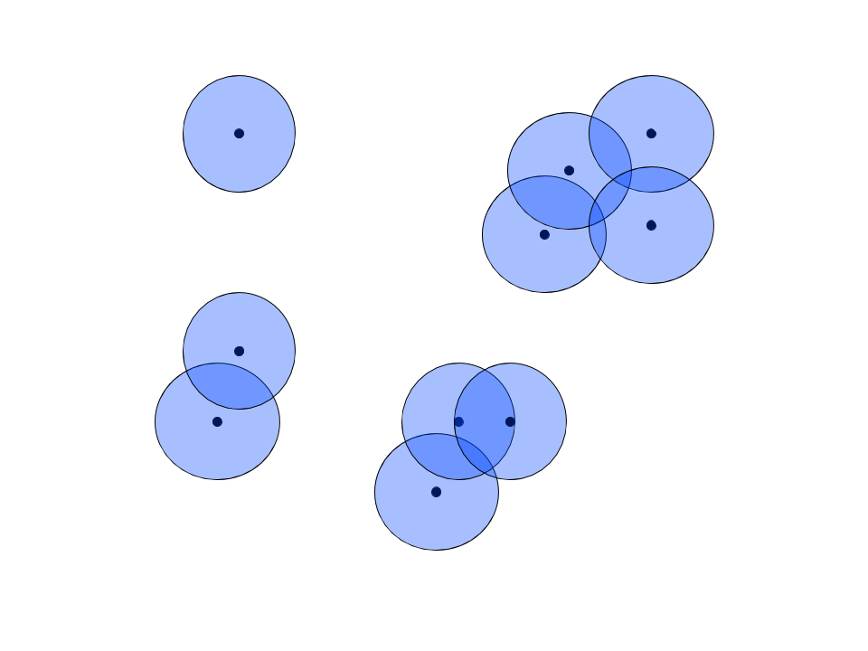
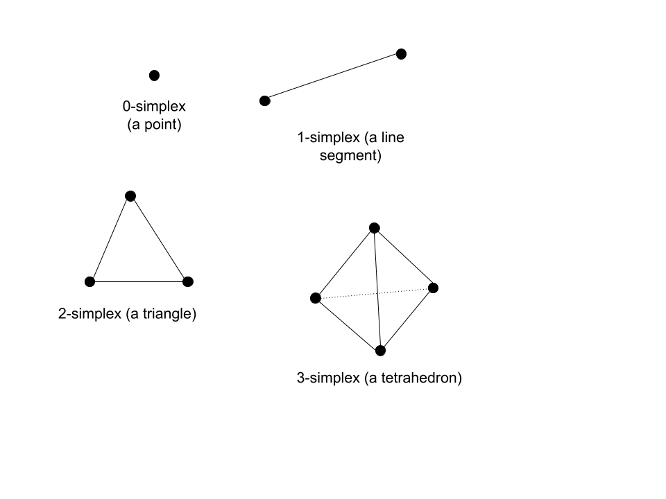
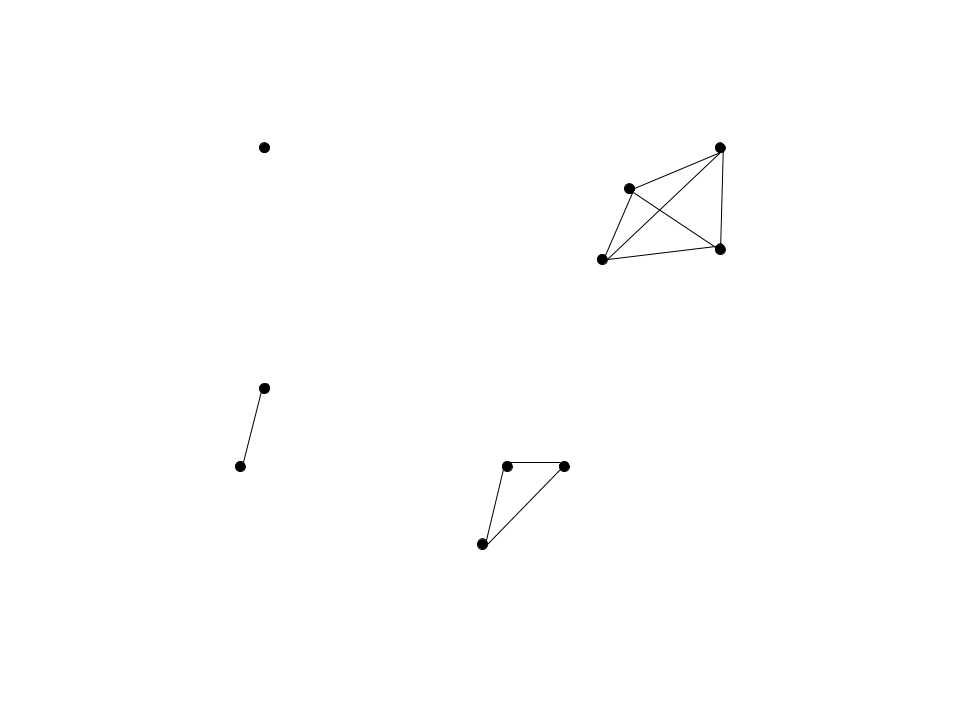
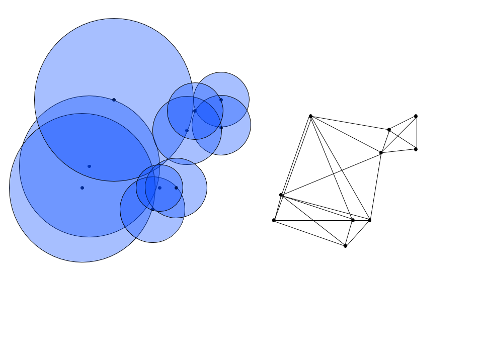
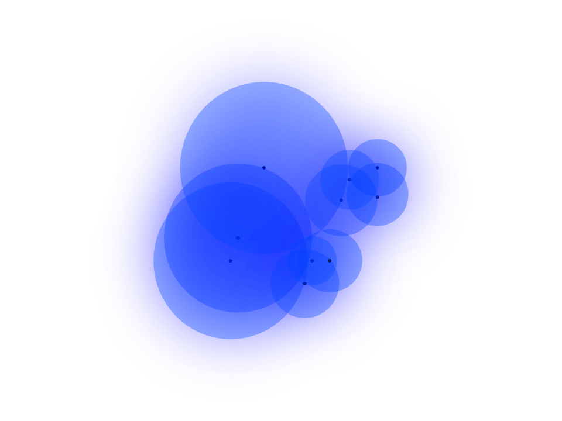

# UMAP: What is it, How does it compare to t-SNE?

## Introduction

When visualizing and exploring large-dimensional datasets, it's often impractical to use every single dimension at one's disposal as any visualization in a dimension greater than two or three can be quite confusing to comprehend. Moreover, training a model in such a high dimension dataset is often not only time-consuming but also unnecessary. This is where dimensionality reduction comes in handy. Several types of dimensionality reduction techniques exist, each with trade-offs in performance and structure preservation qualities. This post will discuss a relatively new type of dimensionality reduction technique known as Uniform Manifold Approximation and Projection (UMAP) and how it works, how it compares to similar dimensionality reduction techniques, and how it applies to image processing, a data science application that involves very high dimensional spaces.

## Dimensionality Reduction

Dimensionality reduction techniques primarily fall into two main categories: matrix factorizations and neighbor graphs. The connecting thread of matrix factorization techniques is that they find linear relationships between features to map to lower-dimensional spaces. The oldest and most notable technique from this category is Principle Component Analysis (PCA). Since these techniques involve linear approximations of the entire feature space, they often capture the global structure of the original high-dimensional feature space very well. However, linear approximations often fail to capture the minute, non-linear relationships that the features may exhibit at a local level. This shortcoming of matrix factorization techniques is where neighbor graph algorithms excel. At the highest level, these algorithms create a graph mapping the observations to a lower-dimensional space while maintaining the relative distance to each observation's closest neighbor in high dimensional space, prioritizing maintenance of these relative distances. The most prominent method of this type is t-Distributed Stochastic Neighborhood Embedding (t-SNE). This is also the category into which UMAP falls.

## How UMAP works

UMAP creates a mapping of the high dimensional data through a set of steps rooted in rigorous topological theory. Below is a brief description of these pieces and how they fit together

### The Simplicial Set

#### The Cover

In the high dimensional space, which we'll call $\mathbb{R}^n$, an $n$-dimensional ball with a given radius is drawn around each observation. Known as a cover in topological analysis, this ball represents the set of points to be considered neighbors of the central observation. For the sake of clarity, our "high dimensional" space is $\mathbb{R}^2$ in this example.

#### Nerve Theorem

The mapping to lower dimensional space relies on the Nerve Theorem, which states the following:

$$\text{Let }\mathcal{U} = \{U_i\}_{i \in I}\text{ be a cover of a topological space }X\text{. If, for all }\sigma \subset I, \bigcap\limits_{i \in \sigma} U_{i}\text{ is either contractible or empty, then }\mathcal{N}(\mathcal{U})\text { is homotropically equivalent to }X.$$

Equivalently, the nerve of the cover of a topological space can be mapped back and forth with the original topological space if the space is fully connected. The nerve of a topological space is the representation of that topological space with simplexes. For context, $n$-dimensional simplexes are $n$-dimension generalizations of the triangle in 2-dimensional space. Below are some examples:

If we take the nerve of our example high-dimensional space, we get the following simplicial set:

### Uniformity Assumption

There's one glaring issue with our simplicial set: it's not fully connected! To circumvent this problem, UMAP employs a clever trick. To connect the unconnected sets, the algorithm defines a Riemannian metric that varies in scale when mapped to Euclidean space, matching the distance of points so that they are uniformly spaced in this new manifold. This allows for the radii of the covers to vary so that each one intersects at least one neighbor, thus connecting the set and giving rise to homotropic equivalence of the mappings. Below, the radii vary so that each ball encompasses an observation's 2 nearest neighbors, and the corresponding nerve of the cover is connected.

#### Fuzzy Cover

The algorithm then takes the additional step of making the cover "fuzzy", meaning that instead of neighbor strength being a binary outcome, any point beyond the solid boundary of a cover is a neighbor of that covered point with some probability. This is similar to how t-SNE uses the t-distribution with 1 degree of freedom to define distance, but instead of the t distribution, UMAP uses an exponential kernel. Thus, the graph of the points becomes fully connected, with each directed edge representing the probability that a point is connected to another. We can then represent each probability as:

$$p_{i|j}=\exp{\left( -\dfrac{d(x_i , x_j) - \rho_i}{\sigma_i} \right)}, p_{ij} = p_{i|j} + p_{j|i} - p_{i|j}p_{j|i}$$

Where $d()$ is the distance between points, $\rho_i$ is the distance to the nearest neighbor of $i$, and $sigma$ is the normalizing factor that determines the radius of the cover. $\rho$ is useful because it ensures that each point is connected to at least one neighbor. Thus, neighbor strength out to the first nearest neighborhood is guaranteed, then exponentially decays any farther away one travels from an individual point. This also presents a workaround for the curse of dimensionality, which states that Euclidean distances between points get smaller and smaller as the number of dimensions increases. While a bit crude, the drawing below should give you an idea of what the fuzzy cover should look like in a 2-dimensional case. Notice how the fill is dense up until the nearest neighbor, then drops off exponentially.

#### Choosing Radii

To choose the right $\sigma$ values, the algorithm solves the following equation, where k is a hyperparameter chosen by the user that represents the number of nearest neighbors:

$$\log_2 \left (k \right) = \sum_{i} p_{ij}$$

This is similar to the equation used to find optimal $\sigma$ in t-SNE, except that the t-SNE version multiplies by an additional $\log \left( p_{ij}\right)$ in the summation. It turns out that leaving out this extra term speeds up the computation quite a bit since computing the log requires a Taylor series approximation that can be quite computationally expensive.

### Lower Dimensional Space: Preserving Global and Local Structure

#### Initialization

With the weights derived for each connection, our undirected graph can be converted into a Laplace matrix. This allows for a mathematical representation of the graph layout. To begin mapping to lower dimensional space of dimension $n$, the algorithm begins with a spectral layout of the Laplace of the graph, meaning each point $i$ is mapped to a point on the plane corresponding to the $i$'th entries of each of the $n$ eigenvectors corresponding to the $n$ largest eigenvalues. This initial layout gives an additional performance boost because it converges on cost function minimization faster than the random initialization of t-SNE. Additionally, this eigenvalue decomposition initialization gives an initial layout that preserves some of the global structures that matrix factorization approaches preserve.

#### Force-Directed Layout

The next step of converging on an optimal layout is very similar to t-SNE, with two important differences that help UMAP preserve the global structure of the dataset and converge more quickly than its neighbor graphing cousin. 

To find an optimal layout, UMAP first describes the membership strength in the lower dimensional setting with the following non-normalized distribution:

$$q_{ij}\left( Y \right) = \dfrac{1}{1+a \|\mathbf{y}_i -\mathbf{y}_j \|^{2b}_{2}}$$

Where $Y$ is the coordinates for all points in the lower dimensional space, $\mathbf{y}$ is the coordinate for a particular point in the lower dimensional space, and a and b are hyperparameters with default values of $a \approx 1.93$ and $b \approx 0.79$. The algorithm then implements a force-directed layout of the points, meaning that a set of attractive and repulsive forces are applied to each point and the relationships between points. While the attractive forces work to ensure that similar points are clumped together, the repulsive force ensures that clumps of dissimilar points are reasonably spaced. This additional repulsive force is what lends UMAP global structure preservation. For any point $i$, the sum of attractive forces acting upon that point, similar to the Kullback–Leibler divergence of t-SNE, is as follows:

$$\sum_{j} p_{ij}\log \left( \dfrac{p_{ij}}{q_{ij}} \right)$$

Similar to the cost function used in t-SNE, it can be thought of as the Kullback–Leibler divergence of the two membership strengths. For the same two points $i$ and $j$, the repulsive force is as follows:

$$\sum_{j} \left( 1 - p_{ij} \right) \log \left( \dfrac{1 - p_{ij}}{1 - q_{ij}}\right)$$

Putting these two terms together, we get the formula for the cross-entropy between the two distributions, which is our cost function that needs to be minimized:

$$CE\left(X, Y\right) = \sum_{i} \sum_{j} p_{ij}\log \left( \dfrac{p_{ij}}{q_{ij}} \right) + \left( 1 - p_{ij} \right) \log \left( \dfrac{1 - p_{ij}}{1 - q_{ij}}\right)$$

Where $X$ is the embedding of the points in the higher dimensional space. Since $X$ does not change, we are only optimizing over the coordinates of the points in the lower dimensional space. Therefore, the cross-entropy is only a function of $Y$, a space with dimensions of the number of observations times the dimension of the target space. This cross-entropy function is then minimized using stochastic gradient descent, which saves time and memory as compared to regular gradient descent, thus speeding up the process of minimization as compared to t-SNE.

## Practical Implications

To observe how UMAP compares to t-SNE, we'll compare the qualitative differences between the resulting plots when the two algorithms are applied to the same dataset.

One high dimensional data science application that is well suited to dimensionality reduction tasks is image recognition. Because certain pixels show far more variance than others, it is often practical and computationally useful to collapse sets of pixel-features down to lower dimensions. Additionally, if we wanted to visualize the differences and relationships between image observations, the dimension space of the number of pixels in an image would be extremely impractical. In this example, we use the MNIST dataset, a dataset of 28-by-28-pixel images of handwritten digits with corresponding labels of 0-9 for the digit that the image of the handwritten digit represents. Since the images are 28 by 28 pixels, the dimension of the manifold in which they live is $\mathbb{R}^{748}$. Below is the result of running t-SNE on 60000 observations from the dataset:

The first thing to notice is the amount of time that was required to create the low-dimensional space embedding: over 37 minutes. The embedding was also initialized with PCA. Should it have been initialized randomly, it would have likely taken even longer. The next important characteristic to notice is the lack of spacing between clusters. While the program does a good job of separating these clusters with a few minor miscalculations, the gaps between clusters are insignificant and equal among all cluster gaps. In contrast, below is a UMAP embedding for the same dataset:

The amount of time required to reach the final result is orders of magnitude smaller than UMAP. This fact alone lends a great amount of credence to UMAP over t-SNE. Additionally, each cluster is well separated from the others and the vast majority of points were placed with their classmates. Concerning clustering ability on the dataset, the two algorithms perform comparably well. What's most interesting is the gaps between clusters. It's interesting to note that observations with 0 and 1 labels, the two digits with perhaps the most different shape, were places very far apart from each other. On the other hand, 3, 8, and 5 were placed close together. The same goes for 7, 9, and 4. While we cannot say anything about *how* these shapes are similar, we can say that there appears to be more global structure preservation due to the differences in spacing between the clusters.

## Summary

In this article, we explored the mathematical foundations of the UMAP dimensionality reduction technique, how and why it differs from t-SNE, and how it performs when applied to the task of image clustering.

## Sources

- Coenen, A., & Pearce, A. (n.d.). Understanding UMAP [Web log post]. Retrieved from https://pair-code.github.io/understanding-umap/

- LeCun et al. (1999): The MNIST Dataset Of Handwritten Digits [Images]. Retrieved from http://yann.lecun.com/exdb/mnist/

- McInnes, L., Healy, J., & Melville, J. (2018). UMAP: Uniform Manifold Approximation and Projection for Dimension Reduction. The Journal of Open Source Software, 3(29), 861st ser. doi:10.21105/joss.00861

- Oskolkov, N. (2019, October 3). How Exactly UMAP Works [Web log post]. Retrieved from https://towardsdatascience.com/how-exactly-umap-works-13e3040e1668

- UMAP Uniform Manifold Approximation and Projection for Dimension Reduction | SciPy 2018 | [Video file]. (2018, July 13). Retrieved from https://www.youtube.com/watch?v=nq6iPZVUxZU

